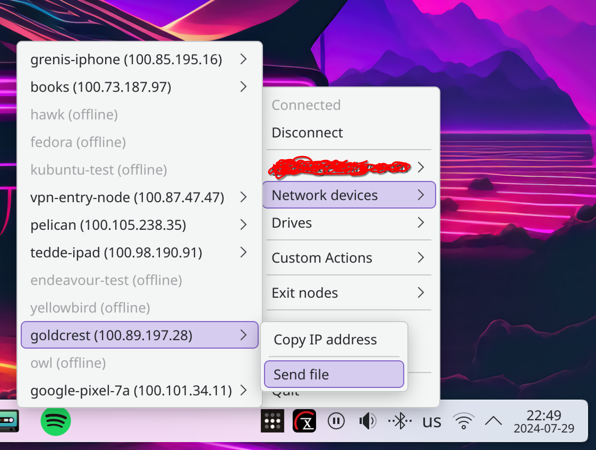

# tail-tray
Tailscale tray menu and UI for Plasma Desktop

**Disclaimer** Please note that I have _no_ association what so ever with Tailscale Inc. This is a personal project and is not endorsed by Tailscale Inc. in any way or form.

### Early development
This project is in early development and is not yet ready for daily use. 
Please use at your own risk. It will have bugs and can crash. File bugs in the issues tab for any issues you find.

The Settings UI is not yet functional and is a placeholder for now. So don't expect anything to work there currently.


### Features
- Control your Tailscale connection from the tray
- Show IPs
- Show current connection status of your devices
- Set and change your Tailscale exit node

### License
GNU General Public License v3.0 - see [LICENSE](LICENSE) for more details

### Installation
Currently, you will need to build it from source yourself.
To do that, plese see the Getting started section below.

### Getting started
1. Install the following dependencies
   * QT 6 and cmake
      * On Ubuntu and Ubuntu based distros      , you can install them with the following command
         ```bash
         sudo apt install qt6-tools-dev qt6-tools-dev-tools g++ clang cmake
         ```
      * On Arch Linux, you can install them with the following command
         ```bash
         sudo pacman -S qt6-basedev qt6-tools-dev clang cmake
         ```
2. Clone the repo
3. cd into the repo `cd tail-tray`
4. Make a build directory `mkdir build`
5. cd into the build directory `cd build`
   6. Run `cmake ../`
7. Run `make`
8. Run `./tailscale-tray` and it should show up in your tray

### Participating & Filing bugs
* If you would like to participate in the development of this project, please feel free to fork the repo and submit a pull request.
* If you find any bugs, please file an issue in the issues tab.

### Screenshots



